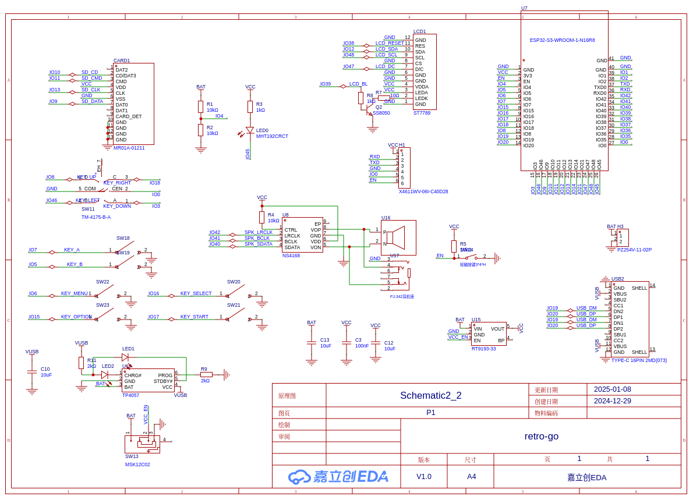

# Esplay-nano
- Status:
- Ref:

This port developed for, based on the ESP32-S3 microcontroller.

# Hardware info

- Espressif ESP32-S3-WROOM-1-N16R8 (16MB flash + 8MB PSRAM)
- Small size: 35\*64\*13 mm
- ST7789-based 1.54-inch IPS LCD with rounded corners
- 5-directions-joystick (X and Y axis, and IO0)
- MicroSD card reader (USB MSC)
- Speaker/3.5mm headphone jack(PJ-342)
- Status LED
- battery charger (TP4057)
- USB-C connector
- One click long press power on/off button

# Images

